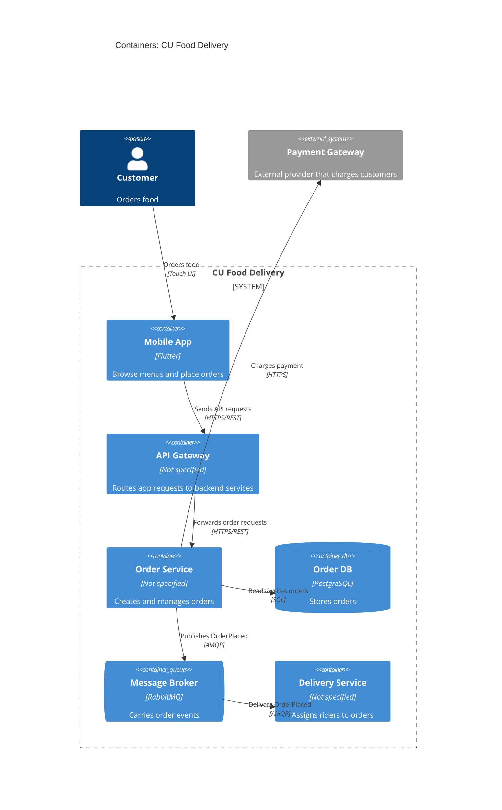

```mermaid
C4Container
    title Containers: CU Food Delivery
    Person(customer, "Customer", "Orders food")
    System_Boundary(fd, "CU Food Delivery") {
        Container(app, "Mobile App", "Flutter", "Browse menus and place orders")
        Container(gateway, "API Gateway", "Not specified", "Routes app requests to backend services")
        Container(order, "Order Service", "Not specified", "Creates and manages orders")
        ContainerDb(orderdb, "Order DB", "PostgreSQL", "Stores orders")
        ContainerQueue(broker, "Message Broker", "RabbitMQ", "Carries order events")
        Container(delivery, "Delivery Service", "Not specified", "Assigns riders to orders")
    }
    System_Ext(payment, "Payment Gateway", "External provider that charges customers")
    Rel(customer, app, "Orders food", "Touch UI")
    Rel(app, gateway, "Sends API requests", "HTTPS/REST")
    Rel(gateway, order, "Forwards order requests", "HTTPS/REST")
    Rel(order, orderdb, "Reads/writes orders", "SQL")
    Rel(order, payment, "Charges payment", "HTTPS")
    Rel(order, broker, "Publishes OrderPlaced", "AMQP")
    Rel(broker, delivery, "Delivers OrderPlaced", "AMQP")
    UpdateLayoutConfig($c4ShapeInRow="2", $c4BoundaryInRow="1")
```
